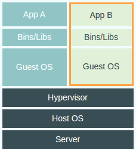

#Docker学习笔记
```language
              _ _       _                    _
__      _____| | |   __| | ___  _ __   ___  | |
\ \ /\ / / _ \ | |  / _` |/ _ \| '_ \ / _ \ | |
 \ V  V /  __/ | | | (_| | (_) | | | |  __/ |_|
  \_/\_/ \___|_|_|  \__,_|\___/|_| |_|\___| (_)
                                              
 
 
 
                        ##        .
                  ## ## ##       ==
               ## ## ## ##      ===
           /""""""""""""""""\___/ ===
      ~~~ {~~ ~~~~ ~~~ ~~~~ ~~ ~ /  ===- ~~~
           \______ o          __/
             \    \        __/
              \____\______/
 
              |          |
           __ |  __   __ | _  __   _
          /  \| /  \ /   |/  / _\ |
          \__/| \__/ \__ |\_ \__  |
 
```
##What is Docker?
>什么是Docker

Docker是一个为开发者和系统管理员`构建`，`部署`，`运行`分布式应用的开源平台。包括：Docker Engine，可移植的轻量运行环境和包管理工具，及`Docker Hub`。Docker Hub是为分享应用和自动化工作流服务的云服务。Docker能够做到apps快速从组件装配并且消除开发，质量评估和产品环境间的冲突。因此，它可以在不改变文件的情况下，在电脑上，数据中心虚拟机，任何云上运行同一款app

##Why do developers like it?
>为什么开发者喜欢Docker

有了Docker，开发者可以用任何语言，使用任何工具链构建任何应用。Docker化的应用完全可移植，并且到处运行：OS x，windows，云上的ubuntu或者是RED HAT上的产品数据中心虚拟机

Docker Hub上有13000+的apps，帮助开发者快速的开始开发。由Docker来管理，跟踪变化和依赖关系。系统管理员可以很容易地理解由开发者开发的app是如何工作的。有了Docker Hub，开发者可以自动构建他们自己的管道或者和合伙人通过`共有`或者`有`repositories来发布他们的产品

Docker帮助开发者开发，部署，快速的高质量应用。

##Why do sysadmins like it?
>为什么系统管理员喜欢Docker

系统管理员为他们（development, QA, and production teams，减少`在自己电脑上运行`带来的调整时间。通过Docker化app平台和app的依赖环境，系统管理员抽象的剥离了系统开销的不同和底层的基础设施。

此外，`Docker Engine`模块的标准化并以此作为部署单元使系统管理员更灵活的调整工作量。无论是否是空的物理机，或者data center VMs或者公共云，`workload deployment`会更加的灵活通过基础架构技术，workload deployment会被企业的政策和次序来驱动。另外，Docker Engine的轻量运行环境允许快速的上架，下架以此响应需求的快速变化。

总的来说，Docker帮助系统管理员快速，稳定的在任何基础设施上部署和运行任何应用。

##How is this different from Virtual Machines?
###Virtual Machines


每个运行在虚拟机里的应用本身的大小的数量级在`MB`，而再加上应用依赖的包和二进制库以及运行应用的虚拟机后，整个系统的大小就会达到惊人的`GB`级别

###Docker


Docker引擎容器仅仅包含一个用和它的依赖项，它作为一个孤立的进程运行在操作系统的用户空间，和其它容器共享内核。因此，它享有特定的资源和虚拟机那样分配的优势，同时更加便捷和高效。

##what can Docker do
* 尝试新软件
* 更加便捷地演示Demos
* 避免“我机器上可以运行”
* 学习 Linux 脚本
* 更好地利用资源
* 为微服务定制
* 在云服务提供商之间移植
* 高效、快速地搭建集群

##common docker commands

```shell
docker version
docker search imageName
docker pull image(<username>/<repository>)
docker run [image name] [command]
docker run [image name] [apt-get install -y ping]
```

>Save your change for image

保存更改使你下次使用这个镜像时能够从这个点开始运行镜像
docker中用来保存状态的操作叫做`commit`
```shell
docker ps -l    查看要保存的进程ID
docker commit id [new image name]
docker commit 698a learn/ping
docker run learn/ping ping www.baidu.com
docker inspect [image id] 查看image的详细信息
```

>push you images to Docker Hub

```language
docker images....查看当前主机上有多少个镜像
docker push [image name]
```

##一些参考
* [Docker Use Cases](http://rominirani.com/2015/04/09/docker-use-cases/)
* [官网：What is Docker](Docker Use Cases)
* [在线体验Docker](https://www.docker.com/tryit/)